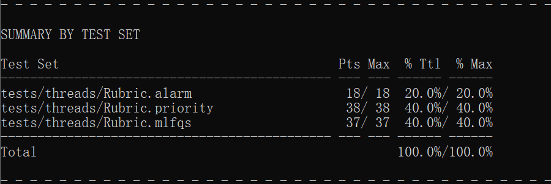
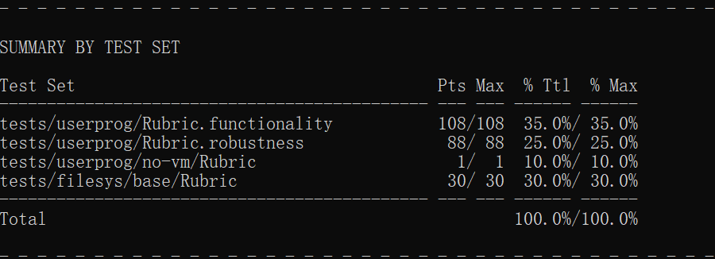
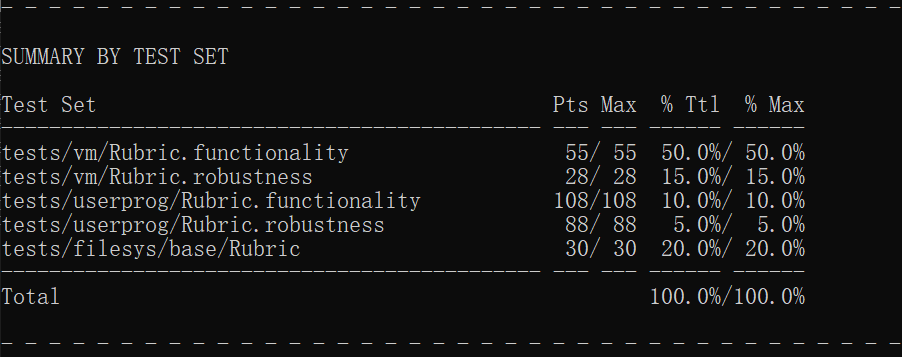
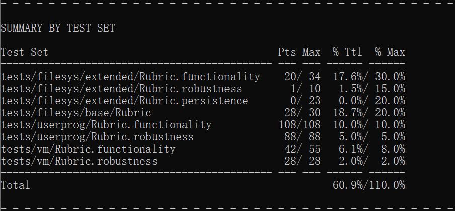

## 分工

吴润哲：threads & user programs

马浩博：virtual memory

毛昕渝、唐泽：file system

## 具体介绍

### Project 1 --- Threads

这个项目不是在考试周写的，前前后后花费了差不多一周时间，很大一部分时间在配环境。

对于``timer_sleep(``)的修改，我们对每一个线程维护了``remaining_sleeping_ticks``，用以记录该线程应当在多少个ticks之后被唤醒，在每次时钟中断时进行检查。

对于``priority``相关的修改，我们维护了每一个线程的当前优先级、目前拥有的所有锁、正在请求的锁等。每次锁的状态发生改变时将判断``priority``是否需要修改。

对于``mlfqs``相关的修改，我们维护了``nice``、``recent_CPU``等必要的信息，并增加了fixed_point.h用于实数计算的。

### Project 2 --- User Programs

这个项目总计也花费了接近一周的时间。

在进程创建的时候，加入了命令行的参数分离。在进程退出的时候，根据要求输出了退出信息。

同时，实现了大量 ``syscall`` 。其中比较麻烦的是，当子进程先于父进程退出时，子进程的返回值需要保存起来。因此我们在父进程中专门用一个数据结构来维护所有子进程的返回值。另一个比较麻烦的是，在创建子进程时，父进程需要等到子进程完全创建成功才能返回，为此我们引入了信号量来维护它们之间的关系。

最后，调用 ``file_deny_write()`` 与 ``file_allow_write()`` 相关的方法实现了拒绝写入自己。

### Project 3 --- Virtual Memory

这个项目总计也花费了接近一周的时间。

在VM中新加了三个文件，``frame.c，page.c，swap.c``，分别维护 ``frame``、``page table`` 以及 ``swap`` 操作。

然后需要修改不少 ``userprog`` 中的代码。比如处理页错误，需要去掉一个page时，会访问``page.c``中有关地址的数据，然后 ``page table`` 是通过以地址作为索引的哈希表来实现的，以此快速索引对应的页面数据。

``frame`` 的替换使用了**二次机会算法**，就是在FIFO的基础上加了一个访问位，访问了就设为1，替换的时候免死一次，然后设为0。反复访问的文件次位始终是一，可以避免像FIFO一样被替换。

### Project 4 --- File System

在 ``filesys`` 中新增了一个文件 ``cache.c``, 实现了缓存。
缓存区的数据结构是一个循环队列，当发现缓存已满时，将采用FIFO的策略为新进入的数据块腾出空间。

在原初的 ``inode`` 中，数据是存储在编号连续的扇区中的，这导致对该文件系统碎片空间的利用率低。因此，我们将 ``inode`` 的结构变为存储所拥有扇区的下标，从而不再要求一段连续编号的扇区。
为支持 ``8MB`` 大小的文件，我们将扇区分为三级

另外， ``cache.c`` 和 ``inode.c`` 对于多线程同步支持较好，加入了一些锁和条件变量来实现这一点。

## 额外特性

``cache`` 模块中实现了定时flush 和 readahead 两个独立运行的线程, 但由于对多线程的支持较差，加上后会导致一些点不能通过测试，故舍弃之。

## Result

